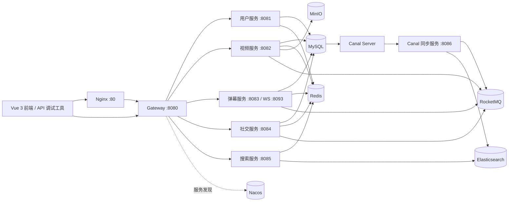

# Bilibili Cloud

一个基于 Java 21、Spring Boot 4、Spring Cloud 和 Vue 3 的视频平台示例项目。项目采用微服务架构，覆盖用户登录、分片上传、视频管理、弹幕、社交互动、搜索以及基于 Canal 的数据同步。

> 仓库同时包含后端微服务和 `bilibili-web` 前端。Nginx 当前只负责 API 反向代理，前端开发服务器默认运行在 `5173`，业务接口统一通过 `/api/**` 调用。

## 功能概览

- 手机验证码、注册、登录、退出和用户资料管理
- 视频分片上传、秒传、合并、发布、播放和列表查询
- RocketMQ Outbox 异步投递与 FFmpeg/MinIO 视频转码
- HTTP 弹幕接口与 Netty WebSocket 弹幕通道
- 数据库驱动的视频分类接口与前端动态分区
- 关注、点赞、评论、收藏和收藏夹管理
- Elasticsearch 视频搜索、搜索建议和热搜
- Redis 缓存、热点统计和 Sa-Token 会话共享
- RocketMQ 异步持久化与事件处理
- MySQL Binlog + Canal 驱动的缓存和搜索索引同步
- Nacos 服务注册发现与 Spring Cloud Gateway 统一路由

## 系统架构



## 技术栈

| 分类 | 技术与版本 |
| --- | --- |
| Java | Java 21 |
| Web 框架 | Spring Boot 4.0.0 |
| 微服务 | Spring Cloud 2025.1.0、Spring Cloud Alibaba 2025.1.0.0 |
| 网关与注册中心 | Spring Cloud Gateway、Nacos 3.1.1 |
| 持久层 | MyBatis-Plus 3.5.16、MySQL 8.4 |
| 缓存与认证 | Redis 7.4、Sa-Token 1.45.0 |
| 消息队列 | RocketMQ 5.3.1 |
| 搜索 | Elasticsearch 9.2.2 |
| 对象存储 | MinIO |
| 数据同步 | Canal 1.1.8 |
| 反向代理 | Nginx 1.27 |
| 构建与部署 | Maven、Docker Compose |

## 模块说明

| 模块 | 默认端口 | 职责 |
| --- | ---: | --- |
| `bilibili-common` | - | 统一响应、公共异常、配置和基础依赖 |
| `bilibili-gateway` | 8080 | API 路由、服务发现和 WebSocket 转发 |
| `bilibili-user-service` | 8081 | 用户、认证、验证码和资料管理 |
| `bilibili-video-service` | 8082 | 视频上传、对象存储、发布、播放和统计 |
| `bilibili-danmu-service` | 8083 / 8093 | 弹幕查询、发送、批量持久化和 WebSocket |
| `bilibili-social-service` | 8084 | 关注、点赞、评论、收藏和收藏夹 |
| `bilibili-search-service` | 8085 | 视频搜索、搜索建议和热搜 |
| `bilibili-canal-service` | 8086 | 订阅 Binlog，维护缓存、布隆过滤器和 ES 索引 |
| `bilibili-web` | 5173 | Vue 3 视频社区前端 |

## 环境要求

- JDK 21
- Maven 3.9+
- Node.js 20+、npm
- Docker Desktop 或 Docker Engine，支持 Compose v2
- 建议为 Docker 分配至少 6 GB 内存
- 首次启动需要能够访问 Maven 仓库和 Docker 镜像仓库

检查本机环境：

```bash
java -version
mvn -version
docker version
docker compose version
```

## 快速启动

以下命令均在项目根目录执行。

### 1. 构建全部服务

```bash
mvn clean package -DskipTests
```

### 2. 启动完整环境

```bash
docker compose -p bilibili -f docker-compose.yml -f docker-compose.service.yml up -d --build
```

首次拉取 MySQL、Nacos、RocketMQ、Elasticsearch、MinIO、Canal 等镜像可能需要几分钟。

### 3. 启动前端

另开一个终端执行：

```bash
cd bilibili-web
npm install
npm run dev
```

前端会通过 Vite 将 `/api` 请求和弹幕 WebSocket 代理到 `http://localhost:8080`。

### 4. 初始化 RocketMQ Topic

首次启动或更换 RocketMQ 数据环境后执行：

```bash
docker exec bilibili-rocketmq-broker sh mqadmin updateTopic -n rocketmq-namesrv:9876 -c DefaultCluster -t video-transcode
docker exec bilibili-rocketmq-broker sh mqadmin updateTopic -n rocketmq-namesrv:9876 -c DefaultCluster -t video-view
docker exec bilibili-rocketmq-broker sh mqadmin updateTopic -n rocketmq-namesrv:9876 -c DefaultCluster -t danmu-persist
docker exec bilibili-rocketmq-broker sh mqadmin updateTopic -n rocketmq-namesrv:9876 -c DefaultCluster -t cache-sync
```

Topic 创建后，因 Topic 尚未就绪而重启的服务会在 `restart: unless-stopped` 策略下自动恢复。也可以主动执行：

```bash
docker compose -p bilibili -f docker-compose.yml -f docker-compose.service.yml restart bilibili-video-service bilibili-danmu-service bilibili-canal-service
```

### 5. 检查状态

```bash
docker compose -p bilibili -f docker-compose.yml -f docker-compose.service.yml ps
```

网关健康检查：

```bash
curl http://localhost:8080/actuator/health
```

正常结果应包含：

```json
{"groups":["liveness","readiness"],"status":"UP"}
```

如果使用已有 MySQL 数据卷，需要手动执行一次 `docker/mysql/migration/001-p0-video-transcode.sql`，为上传转码 Outbox 创建任务表；全新数据卷会由 `docker/mysql/init/02-schema.sql` 自动创建。

## 访问地址

| 服务 | 地址 | 说明 |
| --- | --- | --- |
| Web 前端 | <http://localhost:5173/> | Vite 开发服务器 |
| Nginx | <http://localhost/> | 根路径仅返回环境运行提示 |
| 统一 API | `http://localhost/api/**` | 推荐的业务接口入口 |
| API 网关 | <http://localhost:8080/> | 本地调试可直接访问 |
| Nacos | <http://localhost:8848/nacos/> | 当前开发配置关闭认证 |
| MinIO API | <http://localhost:9000/> | 对象存储 API |
| MinIO Console | <http://localhost:9001/> | 管理控制台 |
| Elasticsearch | <http://localhost:9200/> | REST API |
| MySQL | `localhost:3307` | 容器内仍使用 `3306` |
| Redis | `localhost:6380` | 容器内仍使用 `6379` |
| RocketMQ NameServer | `localhost:9876` | NameServer |
| Canal Server | `localhost:11111` | Canal TCP 服务 |

MySQL 和 Redis 使用非默认宿主机端口，是为了避开本机已有的 `3306` 和 `6379` 服务。

## API 调试

推荐基地址：

```text
http://localhost/api
```

也可以绕过 Nginx，直接使用：

```text
http://localhost:8080/api
```

### 发送验证码示例

```bash
curl --location 'http://localhost:8080/user/sendCode' \
  --header 'Content-Type: application/json' \
  --data-raw '{
    "phone": "16890413072"
  }'
```

成功响应：

```json
{
  "success": true,
  "errorMsg": null,
  "data": null,
  "total": null
}
```

用户接口同时兼容 `/user/**` 和 `/api/user/**`。其余模块建议统一使用 `/api/**` 前缀。

### 主要接口

| 模块 | 方法与路径 |
| --- | --- |
| 用户 | `POST /api/user/code`、`POST /api/user/sendCode`、`POST /api/user/register`、`POST /api/user/login`、`POST /api/user/logout`、`GET /api/user/me`、`PUT /api/user/profile`、`PUT /api/user/password`、`GET /api/user/profile/{userId}` |
| 分类 | `GET /api/category/list` |
| 上传 | `POST /api/upload/check`、`POST /api/upload/chunk`、`POST /api/upload/merge`、`GET /api/upload/progress/{uploadId}`、`GET /api/upload/transcode/{taskId}` |
| 文件兼容接口 | `POST /api/file/check-md5`、`POST /api/file/chunk-upload`、`POST /api/file/merge-chunks`、`GET /api/file/upload-progress/{md5}` |
| 视频 | `POST /api/video/publish`、`GET /api/video/{videoId}`、`GET /api/video/{videoId}/play`、`GET /api/video/list`、`GET /api/video/user/{userId}`、`PUT /api/video/{videoId}`、`DELETE /api/video/{videoId}` |
| 弹幕 | `GET /api/danmu/list/{videoId}`、`POST /api/danmu/send`、`GET /api/danmu/count/{videoId}` |
| 搜索 | `GET /api/search`、`GET /api/search/video`、`GET /api/search/hot`、`GET /api/search/suggest` |
| 关注 | `POST /api/follow/{userId}`、`DELETE /api/follow/{userId}`、`GET /api/follow/status/{userId}`、`GET /api/follow/following/{userId}`、`GET /api/follow/follower/{userId}` |
| 点赞 | `POST /api/like`、`DELETE /api/like`、`GET /api/like/status` |
| 评论 | `POST /api/comment`、`GET /api/comment/list/{videoId}`、`DELETE /api/comment/{commentId}` |
| 收藏 | `POST /api/collection`、`DELETE /api/collection`、`GET /api/collection/list`、`POST /api/collection/folder`、`PUT /api/collection/folder/{folderId}`、`GET /api/collection/folders` |

登录和注册成功后，响应 `data.token` 为 Sa-Token 会话令牌。需要登录的接口可通过请求头携带：

```text
satoken: <token>
```

详细字段、分页参数和业务约定请参阅 [开发手册](./开发手册.md) 和 [项目后端文档](./项目后端.md)。接口文档中若存在设计稿与当前代码差异，以各模块 Controller 为准。

## WebSocket 弹幕

网关路由为：

```text
ws://localhost:8080/api/danmu/ws/{videoId}?token=<token>
```

通过 Nginx 访问时使用：

```text
ws://localhost/api/danmu/ws/{videoId}?token=<token>
```

弹幕服务的直连端口为 `8093`。实际连接参数及消息格式以 `DanmuWebSocketHandler` 的实现为准。

## 数据与默认账号

开发环境默认配置如下：

| 组件 | 用户名 | 密码/说明 |
| --- | --- | --- |
| MySQL | `root` | `root`，宿主机端口 `3307` |
| MySQL Canal 用户 | `canal` | `canal` |
| Redis | - | `redis123`，宿主机端口 `6380` |
| MinIO | `minioadmin` | `minioadmin` |
| Nacos | - | 开发配置关闭认证 |

这些凭据只适合本地开发，部署到共享环境或生产环境前必须通过环境变量或密钥管理系统替换。

MySQL 首次创建数据卷时会自动执行：

- `docker/mysql/init/01-init.sql`：创建数据库和 Canal 用户
- `docker/mysql/init/02-schema.sql`：创建业务表和初始视频分类
- `docker/mysql/init/03-demo-data.sql`：创建可重复执行的全模块演示数据

业务表包括用户、认证、视频、视频统计、分片、弹幕、评论、关注、点赞、收藏夹和收藏记录。

## 演示数据

演示数据覆盖用户、认证、视频状态、播放统计、上传进度、弹幕、评论与回复、关注、点赞、收藏夹和收藏关系。全新 MySQL 数据卷会自动导入；已有数据卷可手动执行：

```bash
docker cp docker/mysql/init/03-demo-data.sql bilibili-mysql:/tmp/03-demo-data.sql
docker exec bilibili-mysql sh -c "mysql -uroot -proot < /tmp/03-demo-data.sql"
```

导入时建议保持 Canal、RocketMQ 和 Elasticsearch 运行，使视频数据同步进入 `video_index`。如果导入时同步服务尚未启动，可在服务就绪后重新执行该幂等脚本。

所有演示账号的密码均为 `Demo@123`：

| 用户 ID | 用户名 | 手机号 | 用途 |
| ---: | --- | --- | --- |
| 1001 | `demo_alice` | `13800001001` | 主要演示账号，拥有视频、关注和收藏数据 |
| 1002 | `demo_bob` | `13800001002` | Java 与工程内容创作者 |
| 1003 | `demo_carol` | `13800001003` | 音乐创作者与互动用户 |
| 1004 | `demo_dan` | `13800001004` | 运动内容创作者 |
| 1005 | `demo_admin` | `13800001005` | 管理员权限演示 |
| 1006 | `demo_eve` | `13800001006` | 美食内容创作者 |

推荐用于接口调试的固定数据：

| 数据 | ID/值 | 说明 |
| --- | --- | --- |
| 热门视频 | `2001` | 包含弹幕、评论、点赞和统计数据 |
| 其他已发布视频 | `2002`—`2010` | 覆盖分类、作者、热度和发布时间排序 |
| 审核中视频 | `2011` | 不出现在公开列表 |
| 审核拒绝视频 | `2012` | 用于状态演示 |
| 评论及回复 | `3001`—`3019` | 覆盖一级评论与回复树 |
| 收藏夹 | `6001`—`6006` | 覆盖公开、私密和默认收藏夹 |
| 上传中任务 | `demo-upload-in-progress` | 已上传 2/3 个分片 |
| 已发布文件 MD5 | `11111111111111111111111111112001` | 可用于秒传检测 |

登录示例：

```bash
curl --location 'http://localhost/api/user/login' \
  --header 'Content-Type: application/json' \
  --data-raw '{
    "username": "demo_alice",
    "password": "Demo@123",
    "terminal": "web"
  }'
```

脚本仅更新保留 ID 范围内的基准记录，不会清空普通用户数据。通过接口新建的数据也不会在重跑脚本时被删除。

## 常用运维命令

查看全部日志：

```bash
docker compose -p bilibili -f docker-compose.yml -f docker-compose.service.yml logs -f
```

查看单个服务日志：

```bash
docker logs -f bilibili-gateway
docker logs -f bilibili-user-service
```

重启网关：

```bash
docker compose -p bilibili -f docker-compose.yml -f docker-compose.service.yml restart bilibili-gateway
```

停止并删除容器，保留数据卷：

```bash
docker compose -p bilibili -f docker-compose.yml -f docker-compose.service.yml down
```

同时删除数据卷并重新初始化数据库：

```bash
docker compose -p bilibili -f docker-compose.yml -f docker-compose.service.yml down -v
```

> `down -v` 会删除 MySQL、Redis、Elasticsearch 和 MinIO 的本地数据，请确认不再需要这些数据后再执行。

## 测试

运行全部测试：

```bash
mvn test
```

仅测试单个模块，并同时构建其依赖模块：

```bash
mvn -pl bilibili-video-service -am test
```

当前测试集包含 49 个测试，覆盖视频上传与业务逻辑、转码 Outbox 投递与状态反馈、播放量幂等、弹幕批量持久化、社交互动、搜索和 Canal 同步等核心场景。

## 项目结构

```text
.
├── bilibili-common/          # 公共响应、异常和配置
├── bilibili-gateway/         # Spring Cloud Gateway
├── bilibili-user-service/    # 用户与认证
├── bilibili-video-service/   # 视频与文件上传
├── bilibili-danmu-service/   # HTTP / WebSocket 弹幕
├── bilibili-social-service/  # 关注、点赞、评论、收藏
├── bilibili-search-service/  # Elasticsearch 搜索
├── bilibili-canal-service/   # Binlog、缓存和索引同步
├── bilibili-web/             # Vue 3 前端
├── docker/
│   ├── canal/                # Canal instance 配置
│   ├── mysql/init/           # 数据库初始化 SQL
│   └── nginx/                # Nginx 配置
├── docker-compose.yml        # 基础设施
├── docker-compose.service.yml# Java 微服务
├── pom.xml                   # Maven 聚合工程
├── 开发手册.md               # 详细接口与技术设计
└── 项目后端.md               # 后端设计文档
```

## 常见问题

### 请求网关返回 404

确认请求路径已被 `bilibili-gateway/src/main/resources/application.yml` 中的路由覆盖。推荐统一使用 `/api/**`。用户接口额外兼容 `/user/**`，例如 `/user/sendCode`。

### 请求网关返回 503

通常表示网关已经匹配路由，但没有可用的服务实例。依次检查：

```bash
docker compose -p bilibili -f docker-compose.yml -f docker-compose.service.yml ps
docker logs bilibili-gateway
docker logs bilibili-user-service
```

同时在 Nacos 控制台确认目标服务已注册且状态健康。

### MySQL 或 Redis 默认端口连接失败

宿主机连接使用 MySQL `3307`、Redis `6380`；容器网络内部仍使用 `mysql:3306` 和 `redis:6379`。

### 数据库表没有重新初始化

初始化 SQL 只会在 MySQL 数据卷第一次创建时执行。需要完全重建时可使用 `down -v`，但该命令会删除全部本地持久化数据。

### 搜索结果为空

确认 Elasticsearch、Canal Server、`bilibili-canal-service` 和 RocketMQ 均正常运行，并检查 `cache-sync` Topic 是否存在。新写入或更新的视频数据会经 Canal 同步到 Elasticsearch。

### 视频转码失败或播放地址无法访问

视频服务镜像会安装 FFmpeg，并从 MinIO 的 `source/` 对象读取源文件，将 MP4 产物写入 `play/`。应用默认只给播放产物前缀配置匿名读权限，不会公开源文件；可通过 `MINIO_PUBLIC_READ_ENABLED=false` 关闭。Compose 默认把 `MINIO_PUBLIC_ENDPOINT` 配置为 `http://localhost:9000`，如果前端不在宿主机访问，请按实际浏览器可访问的 MinIO 地址覆盖该变量。

### Docker 构建时访问 Docker Hub 超时

这是镜像仓库网络问题。确认代理或网络配置后重新执行 Compose 构建；Java 代码可以先通过 Maven 单独构建，不受 Docker Hub 状态影响。
